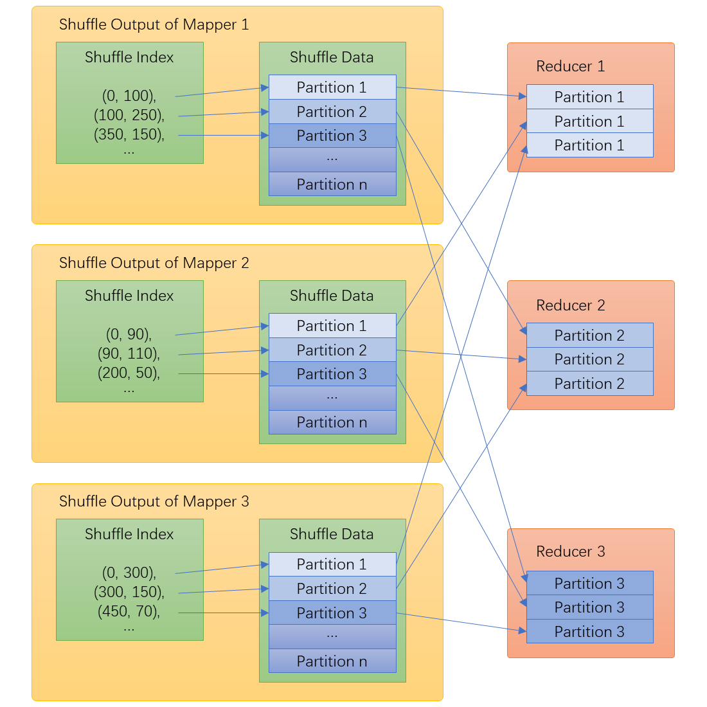
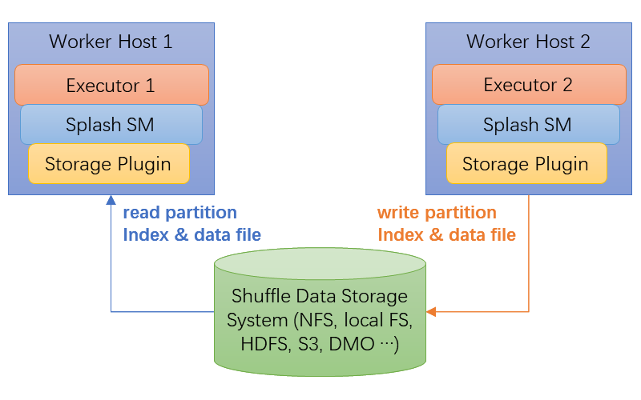
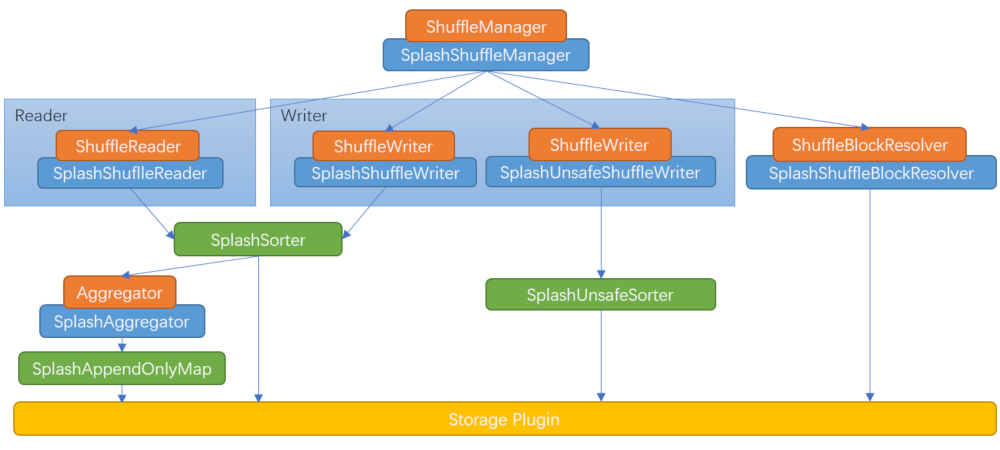
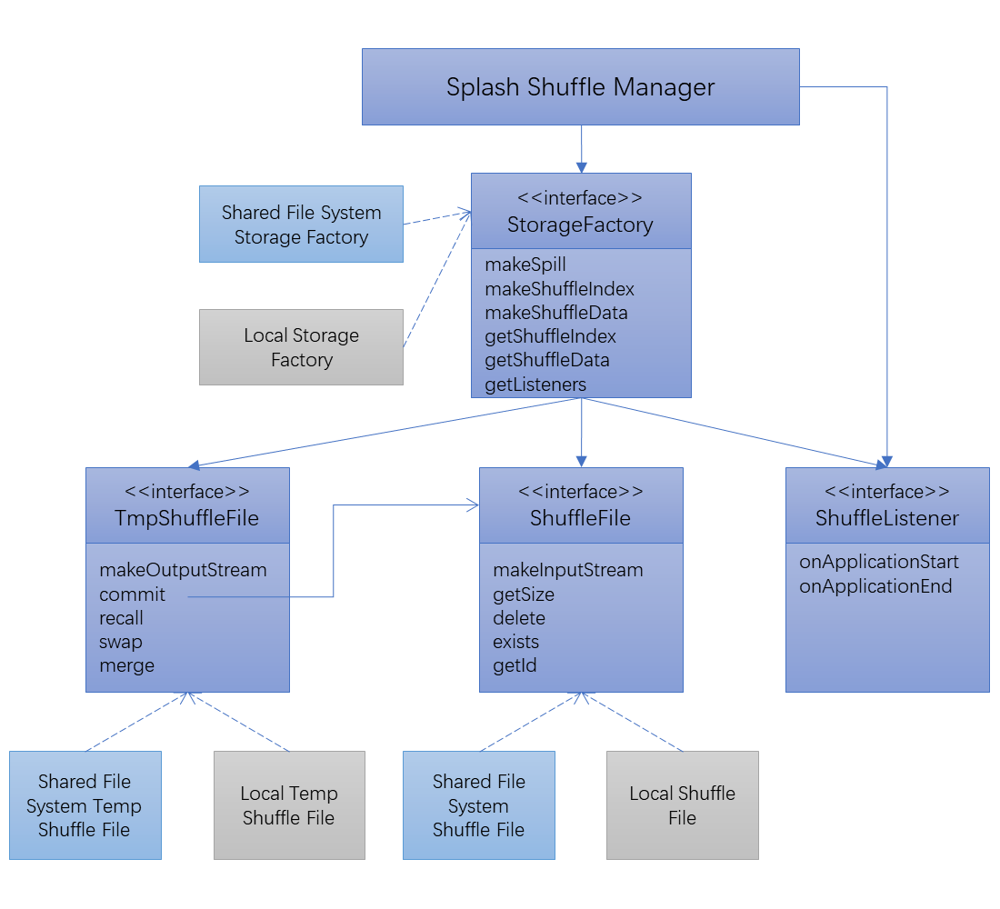
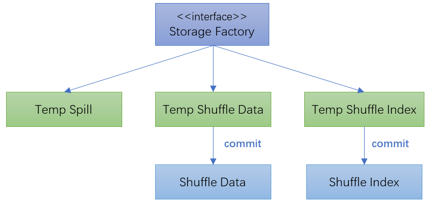

# Splash Design

This document describes the design details of the Splash project.

## Shuffle Algorithm
The shuffle algorithm for Splash is derived from the original shuffle 
manager.  The following section briefly describes the process of shuffle in Spark.

* The shuffle procedure has two stages: the map stage and the reduce stage.
* In the map stage, each mapper generates a map output which includes two types 
  of files: index file and data file.
* The index file contains a list of metadata that describes the start and the 
  length of a partition stored in the data file.
* In the reduce stage, a reducer collects the partitions belonging to it from 
  the map outputs generated in the map stage.  These partitions form the input 
  of the reducer for its incoming reduce operation.

There are three handlers in the original Spark shuffle manager:
* The bypass merge sort shuffle handler is applied when partition count is lower 
  than 200 (by default).
* The unsafe shuffle handler is applied when there is no map side combine, and the 
  serialized data could safely be relocated.
* The base shuffle handler is the default shuffle implementation.

Splash shuffle manager introduces some modifications to these handlers:

* Local file access is replaced by the `ShuffleFile` interface, which provides 
  a more general abstraction that supports both local and remote file access.
* The logic of committing writes is moved to `TmpShuffleFile`.
* The actual network and storage operations are wrapped in the `OutputStream` 
  and `InputStream` constructed by `TmpShuffleFile` and `ShuffleFile`.
* The read/write operations in shuffle only communicate with `InputStream` and 
  `OutputStream` which is decoupled from a specific network/storage.  Shuffle 
  read and write can be implemented using different network transports and 
  backend storage protocols by providing different implementations of the I/O steams.
* Listeners are inserted into different stages of the shuffle to apply hooks.

## Architecture

In vanilla Spark, each executor directly interacts with to its local disks and 
network.  

Splash shuffle manager, instead implements two layers of abstraction between 
executors and the actual storage and network.
* The first layer contains the logic for the shuffle.
* The second layer contains the logic for storage and network.

There are several advantages of this architecture:
* The shuffle manager becomes stateless which makes executors stateless.
* Stateless compute node provides the flexibility to add and remove node without 
  re-computing the whole shuffle
* The commit operation of the shuffle file is atomic.  Un-committed files can 
  be cleaned up easily.
* The separation of storage and computation in shuffle gives the user more 
  choices on the storage media. 

  The user can implement different storage plugins through the splash storage 
  interface base on their requirement.
  
  For instance, user can have a separate dedicated storage cluster for 
  storing the shuffle data.
* Through the implementation of the storage plugin, the user can have a separated 
  storage cluster for shuffle data, which can provide large capacity and high 
  reliability.
* Compared to external shuffle service, Splash shuffle manager lives in the 
  executor which reduces the complexity of system and deployment.

Here is the architecture diagram for Splash shuffle manager:
* The orange boxes represent interfaces defined by Spark
* The blue boxes represent Splash implementation classes.
* The green boxes represent basic data structures.

More specifically:
* `ShuffleManager` is the entry point for the shuffle stage.
* `ShuffleWriter` is responsible for writing the shuffle data in map stage.  It 
  utilizes `SplashSorter` or `SplashUnsafeSorter` to hold the data in memory.  
  If there is not enough memory, it spills the data to `TmpShuffleFile`.
*  After all data are processed, `SplashSorter` and `SplashUnsafeSorter` merges
  the data in both memory and spilled files, forms the shuffle output and 
  persists it with the storage interface.
* `ShuffleReader` is used in the reducer stage to collect data from the storage 
  interface.
* `SplashAggregator` is responsible for data aggregation.  It uses `SplashAppendOnlyMap` to hold the data in memory and spill to `TmpShuffleData` if there is not enough memory.
* `SplashShuffleBlockResolver` is used to locate the shuffle data in storage.  The algorithm to find shuffle data is stateless.

## Storage Plugin

The user supplies its own storage/network implementation for Splash shuffle manager by implementing the storage-plugin.  Two plugins are provided out of the box:
* The shared file system plugin runs on a mountable shared file system like NFS.
* The local file system plugin implements the same behavior as the original Spark shuffle manager.

This diagram illustrates the structure of the storage plugin framework.

The functionality of each interface is described below:

## `StorageFactory` interface

This interface defines the entry point for the storage/IO functions.  The 
methods of this interface could be divided into several categories.

* Metadata operations return the storage metadata such as:
  * `getShuffleFolder` retrieves the location of the shuffle files of the specified application.   
  * the number of temp files and shuffle files we have.
    These methods are used in test only.  There is no performance requirement on these operations.
    * `getShuffleFileCount` returns the total number of shuffle files managed by the plugin.
    * `getTmpFileCount` returns the total number of temp files managed by the plugin.
* Temp file generators create the temp files for IO.  Those temp files are
  divided into three types based on their use cases:
  * `makeSpillFile` retrieves a writable `TmpShuffleFile` instance for spill temp file.

    Spill temp files are used for spill.  They could be persisted in local storage or SSD to speed up the spill.
  * `makeDataFile` retrieves a writable `TmpShuffleFile` instance.

    This temp file will be committed to a shuffle data file when write completes.
  * `makeIndexFile` retrieves a writable `TmpShuffleFile` instance.

    This temp file will be committed to a shuffle index file when write completes.
  
  
  
* `getDataFile` and `getIndexFile` are used to retrieve the `ShuffleFile` instance.
  * `getDataFile` retrieves a read only `ShuffleFile` instance for shuffle data file.
  * `getIndexFile` retrieves a read only `ShuffleFile` instance for shuffle index file.
* `getListeners` retrieve a collection of shuffle manager listeners.
* `setConf` passes the `SparkConf` instance to the `StorageFactory` instance so that
  storage plugins could receive configurations defined in Spark configurations.
* Cleanup methods reset the shuffle output or temp folders.
  * `cleanShuffle` cleans up the shuffle files of the specified application.
  * `reset` cleans up all files managed by the storage plugin.

## `ShuffleFile` interface

This is the interface for shuffle related files.  It works like the 
Java `File` class.  The files referenced by `ShuffleFile` are read only.
* `getSize` retrieves the size of the file.
* `exists` checks the existence of the file.
* `delete` removes the file.
* `getId` usually returns the path of the file instance.
* `makeInputStream` constructs a `InputStream` of this `ShuffleFile`.

## `TmpShuffleFile` interface

This interface extends `ShuffleFile`.  In addition:
* `commit` and `recall` are atomic methods that allow user to commit the shuffle output or delete it.
* `swap` is used to speed up the data exchange between 2 temp files.
* `merge` is used to speed up the process of merging multiple files into one file.
  The default implementation of this method is to copy and concatenate a list of files into one large file.
* `makeOutputStream` constructs an `OutputStream` of this `TmpShuffleFile`.
  Plugin developers need to make sure that this method creates the underlying file if it does not exist.
* `uuid` returns a unique UUID instance of this `TmpShuffleFile`.
* `create` method creates the actual file in the storage.  This method is only used
  for creating an empty file.
* `getCommitTarget` retrieves the target `ShuffleFile`.  It is not valid for a spill file because it will not
  be committed to a shuffle file.

## `ShuffleListener` interface

Define the listeners to invoke during the shuffle procedure.  This interface is not mature yet.
